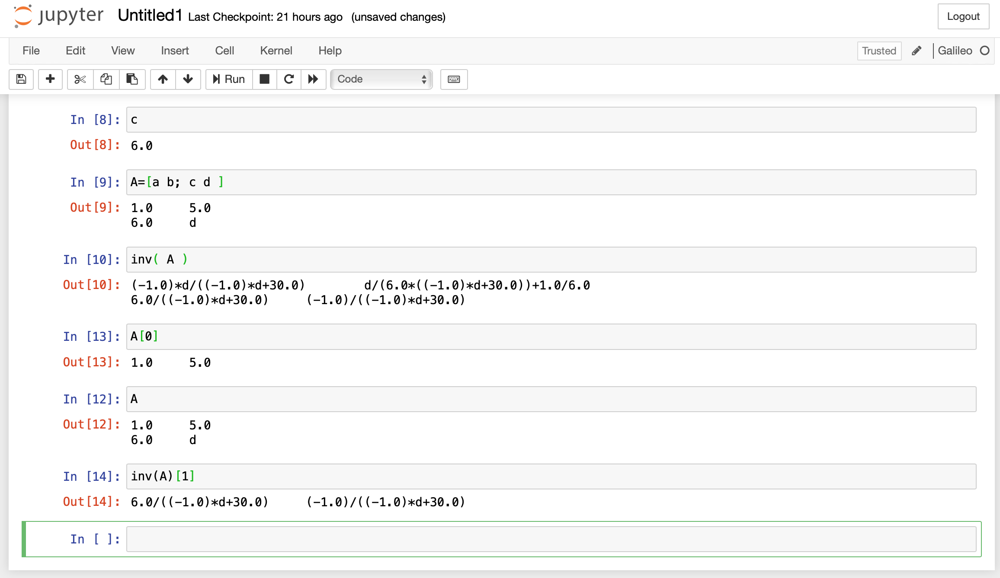

## iGalileo

iGalileo is a [Galileo](https://github.com/cascala/galileo) kernel for use alongside the Jupyter framework

This allows users to experiment with Galileo using powerful Jupyter notebooks



## Installation

The galileo kernel can be run in two ways: Using Docker or by building it from source. For either approach, a small file `kernel.json` has to be placed in a new folder in your home or user directory:
* Mac:`~/Library/Jupyter/kernels/igalileo/kernel.json`
* Linux: `~/.local/share/jupyter/kernels\igalileo\kernel.json`
* Windows: `%APPDATA%\jupyter\kernels\igalileo\kernel.json`
A sample `kernel.json` file is in the `igalileo` folder, containing:
```
{
    "argv": [
        "<PATH_TO_GALILEO>/run_{docker|sbt}.sh",
        "{connection_file}"
    ],
    "display_name": "iGalileo",
    "language": "galileo"
}
```
Replace <PATH_TO_GALILEO> with the absolute path to the kernel folder (the one containing the kernel.json file, created above), and point to either `run_docker.sh` or `run_sbt.sh`.
If all goes will, iGalileo should be listed as part of the available Jupyter kernels. You can see that list with the command
```
jupyter kernelspec list
```

### Using Docker
This is the easiest route and should only take a few minutes.
Having a working docker environment is the only prerequisite.

Select `run_docker.sh` above as the script, and copy `run_docker.sh` from the `igalileo` folder here to the kernel folder.

### Building from source
Prerequisites:
* A scala and java environment including the sbt build tool
* Download this repo from git and ensure the package can be built without error:
    * `git clone https://github.com/cascala/igalileo.git`
    * `cd igalileo`
    * `sbt package`

Select `run_sbt.sh` above as the script, and copy `run_sbt.sh` from the igalileo folder here to the kernel folder.

## Running iGalileo

Launch Jupyter as usual (`jupyter notebook`), and select the Galileo kernel.
Good luck - don't hesitate to share any feedback as an [issue](https://github.com/cascala/igalileo/issues/new).
